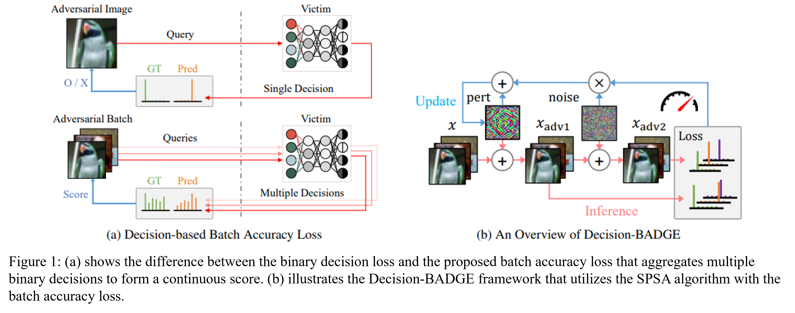
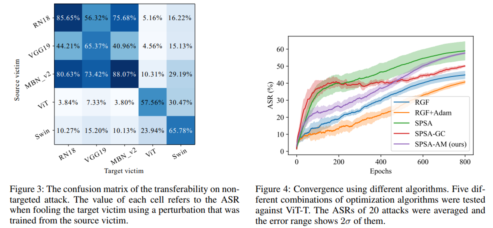
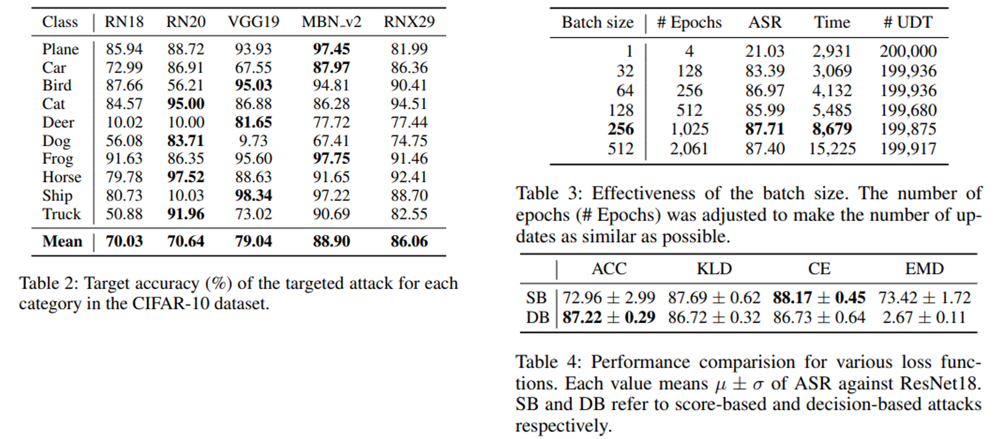
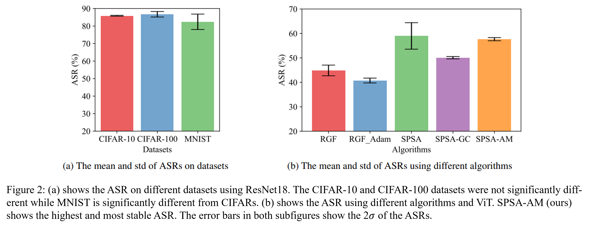

# Decision-BADGE
Code for the paper "[Decision-BADGE: Decision-based Adversarial Batch Attack with Directional Gradient Estimation](https://arxiv.org/abs/2303.04980)".
### Abstract
> The susceptibility of deep neural networks (DNNs) to adversarial examples has prompted an increase in the deployment of adversarial attacks. Image-agnostic universal adversarial perturbations (UAPs) are much more threatening, but many limitations exist to implementing UAPs in real-world scenarios where only binary decisions are returned. In this research, we propose Decision-BADGE, a novel method to craft universal adversarial perturbations for executing decision-based black-box attacks. To optimize perturbation with decisions, we addressed two challenges, namely the magnitude and the direction of the gradient. First, we use batch loss, differences from distributions of ground truth, and accumulating decisions in batches to determine the magnitude of the gradient. This magnitude is applied in the direction of the revised simultaneous perturbation stochastic approximation (SPSA) to update the perturbation. This simple yet efficient method can be easily extended to score-based attacks as well as targeted attacks. Experimental validation across multiple victim models demonstrates that the Decision-BADGE outperforms existing attack methods, even image-specific and score-based attacks. In particular, our proposed method shows a superior success rate with less training time. The research also shows that Decision-BADGE can successfully deceive unseen victim models and accurately target specific classes.
### Architecture

### Experiments
#### Figures


#### Benchmarks


### Supplementary Material




## Usage
### Setup Workspace
Clone this Git repository.
```bash
git clone "https://github.com/AIRLABkhu/Decision-BADGE.git"
cd "Decision-BADGE"

# Unzip checkpoitns. (OPTIONAL)
cd "log"
cat "log.tar.gz*" | tar xvzf -
rm "log.tar.gz*"
cd ".."
```
### Run Training
You can train your own victim model. (OPTIONAL)
```bash
# https://github.com/AIRLABkhu/Decision-BADGE/blob/main/train_victim.py
python train_victim.py --device cuda:{ID} --model resnet18 --tag "cifar10_resnet18"
```
Then train a new perturbation.
```bash
# https://github.com/AIRLABkhu/Decision-BADGE/blob/main/train_attack_spsa.py
python train_attack_spsa.py --device cuda:{ID} --checkpoint "cifar10_resnet18" --tag "_baselines/00"
```
All files related with this training will be saved in ```"log/cifar10_resnet18/_baselines/00"```. \
If you want to use Adam optimizer, try ```-c "cifar10-optim/adam"``` option.
```bash
python train_attack_spsa.py --device cuda:{ID} --checkpoint "cifar10_resnet18" -c "cifar10-optim/adam" --tag "_baselines/00"
```
There are several option you could try.
```bash
python  train_attack_spsa.py --device cuda:{ID} --checkpoint "cifar10_resnet18" --tag "_baselines/00" \
        --seed {SEED}               \  # The random seed for training.
        --benchmark                 \  # Specify to use benchmark algorithm or not. Deterministic algorithms will be applied if not specified.
        --epochs {EPOCHS}           \  # The number of epochs for training.
        --beta {BETA}               \  # A hyperpameter that denotes the standard deviation of normal step noise.
        --learning-rate {LR}        \  # (or -lr) specifies the step size.
        --batch-size {BS}           \  # The size of a batch in training phase.
        --eval-batch-size {EBS}     \  # The size of a batch in evaluation phase.
        --accumulation {ACCM}       \  # How many batches to use to update the perturbation once.
        --max-iters {ITERS}         \  # The number of batches to train in one epoch.
        --sliding-window-batch      \  # (or -swb). If you enable this flag, accumulated batches will be reused, dropping the first one.
        --augmentations {AUG...}    \  # Augmentation recipe filenames.
        --target {TARGET}           \  # The target class of an attack.
        --budget {BUDGET}           \  # The maximum permitted magnitude of a perturbation.
        --regulation {REG}          \  # Which `l` to use for `p_l`-norm in regulation.
        --eval-step-size {ESS}      \  # The period of evalation epoch.
        --loss-func {LOSS}          \  # The name of a loss function.
        --use-logits                   # If you enable this flag, the perturbation will be trained using the scores, not the decisions.
```
You can also try `train_attack.py` with RGF and `train_attack_nes.py` with NES optimization.

## Citation
If you use this code in your paper, please consider citing this ```BibTeX``` entry.
```bibtex
@misc{yu_arxiv_2023,
  doi = {10.48550/ARXIV.2303.04980},
  url = {https://arxiv.org/abs/2303.04980},
  author = {Yu Geunhyeok and Jeon Minwoo and Hwang Hyoseok},
  keywords = {Computer Vision and Pattern Recognition (cs.CV)},
  title = {Decision-BADGE: Decision-based Adversarial Batch Attack with Directional Gradient Estimation},
  publisher = {arXiv},
  year = {2023},
  copyright = {arXiv.org perpetual, non-exclusive license}
}
```
