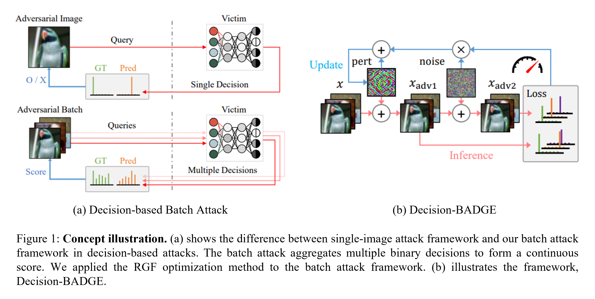

# Decision-BADGE
Code for the paper "[Decision-BADGE: Decision-based Adversarial Batch Attack with Directional Gradient Estimation]()".
### Abstract
> The vulnerability of deep neural networks to adversarial examples has led to the rise in the use of adversarial attacks. While various decision-based and universal attack methods have been proposed, none have attempted to create a decision-based universal adversarial attack. This research proposes Decision-BADGE, which uses random gradient-free optimization and batch attack to generate universal adversarial perturbations for decision-based attacks. Multiple adversarial examples are combined to optimize a single universal perturbation, and the accuracy metric is reformulated into a continuous Hamming distance form. The effectiveness of accuracy metric as a loss function is demonstrated and mathematically proven. The combination of Decision-BADGE and the accuracy loss function performs better than both score-based image-dependent attack and white-box universal attack methods in terms of attack time efficiency. The research also shows that Decision-BADGE can successfully deceive unseen victims and accurately target specific classes.
### Architecture

### Experiments
#### Figures

#### Benchmarks


## Usage
### Setup Workspace
Clone this Git repository.
```bash
git clone "https://github.com/AIRLABkhu/Decision-BADGE.git"
cd "Decision-BADGE"

# Unzip checkpoitns. (OPTIONAL)
cd "log"
cat "log.tar.gz*" | tar xvzf -
rm "log.tar.gz*"
cd ".."
```
### Run Training
You can train your own victim model. (OPTIONAL)
```bash
# https://github.com/AIRLABkhu/Decision-BADGE/blob/main/train_victim.py
python train_victim.py --device cuda:{ID} --model resnet18 --tag "cifar10_resnet18"
```
Then train a new perturbation.
```bash
# https://github.com/AIRLABkhu/Decision-BADGE/blob/main/train_attack.py
python train_attack.py --device cuda:{ID} --checkpoint "cifar10_resnet18" --tag "_baselines/00"
```
All files related with this training will be saved in ```"log/cifar10_resnet18/_baselines/00"```. \
If you want to use Adam optimizer, try ```-c "cifar10-optim/adam"``` option.
```bash
python train_attack.py --device cuda:{ID} --checkpoint "cifar10_resnet18" -c "cifar10-optim/adam" --tag "_baselines/00"
```
There are several option you could try.
```bash
python  train_attack.py --device cuda:{ID} --checkpoint "cifar10_resnet18" --tag "_baselines/00" \
        --seed {SEED}               \  # The random seed for training.
        --benchmark                 \  # Specify to use benchmark algorithm or not. Deterministic algorithms will be applied if not specified.
        --epochs {EPOCHS}           \  # The number of epochs for training.
        --beta {BETA}               \  # A hyperpameter that denotes the standard deviation of normal step noise.
        --learning-rate {LR}        \  # (or -lr) specifies the step size.
        --batch-size {BS}           \  # The size of a batch in training phase.
        --eval-batch-size {EBS}     \  # The size of a batch in evaluation phase.
        --accumulation {ACCM}       \  # How many batches to use to update the perturbation once.
        --max-iters {ITERS}         \  # The number of batches to train in one epoch.
        --sliding-window-batch      \  # (or -swb). If you enable this flag, accumulated batches will be reused, dropping the first one.
        --augmentations {AUG...}    \  # Augmentation recipe filenames.
        --target {TARGET}           \  # The target class of an attack.
        --budget {BUDGET}           \  # The maximum permitted magnitude of a perturbation.
        --regulation {REG}          \  # Which `l` to use for `p_l`-norm in regulation.
        --eval-step-size {ESS}      \  # The period of evalation epoch.
        --loss-func {LOSS}          \  # The name of a loss function.
        --use-logits                   # If you enable this flag, the perturbation will be trained using the scores, not the decisions.
```

## Citation
If you use this code in your paper, please consider citing this ```BibTeX``` entry.
```bibtex
Will be uploaded soon.
```
